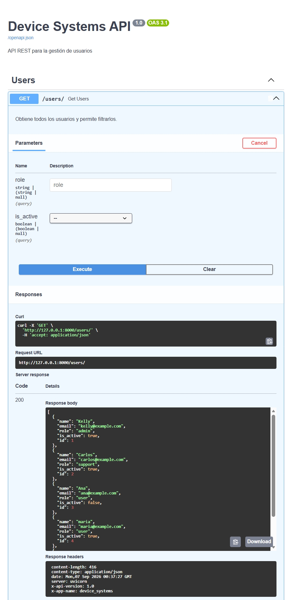
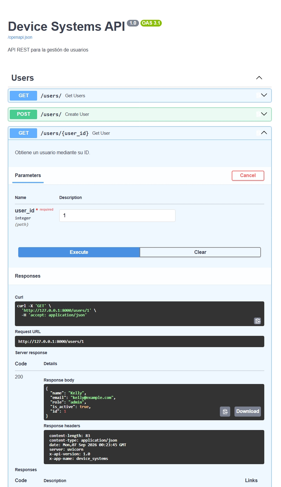
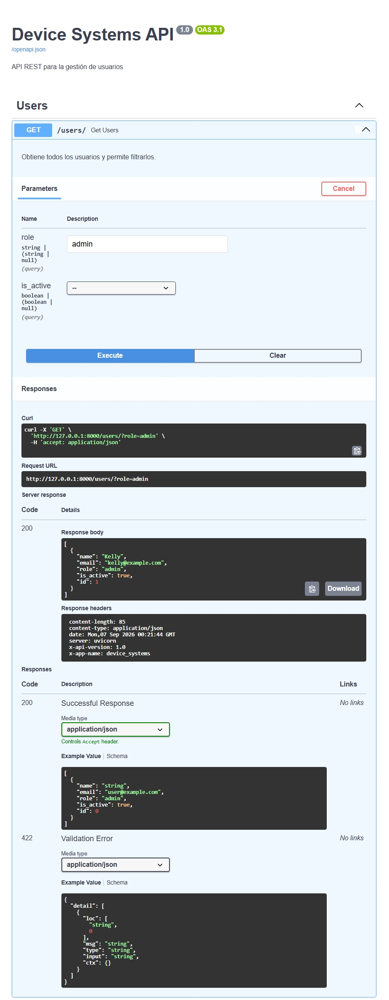
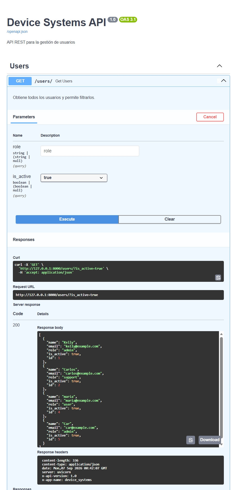
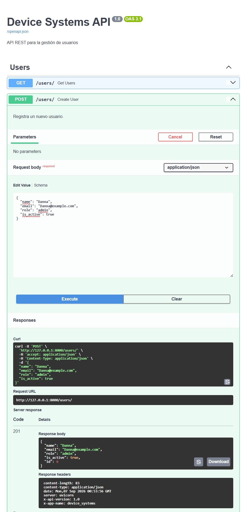
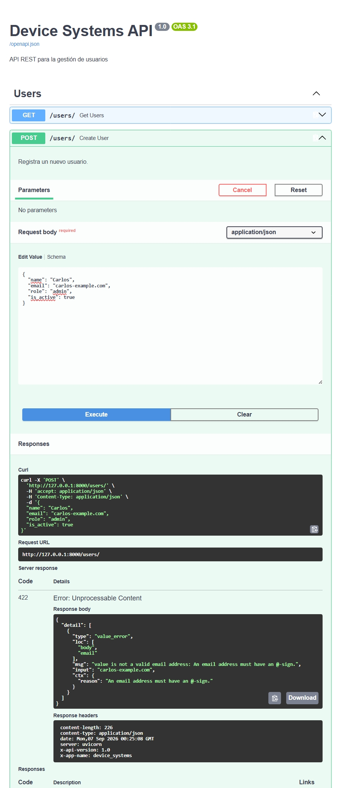
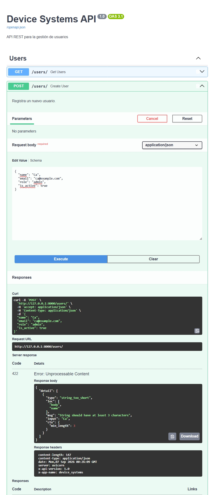
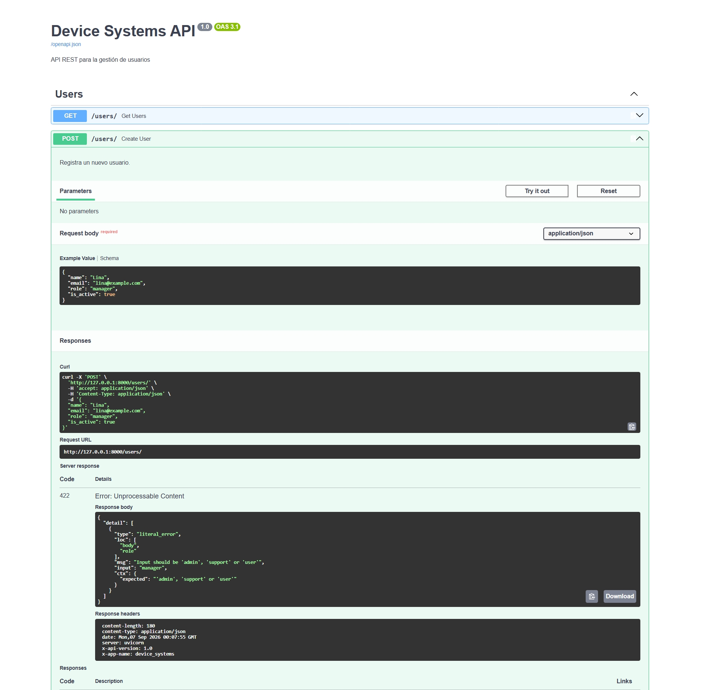
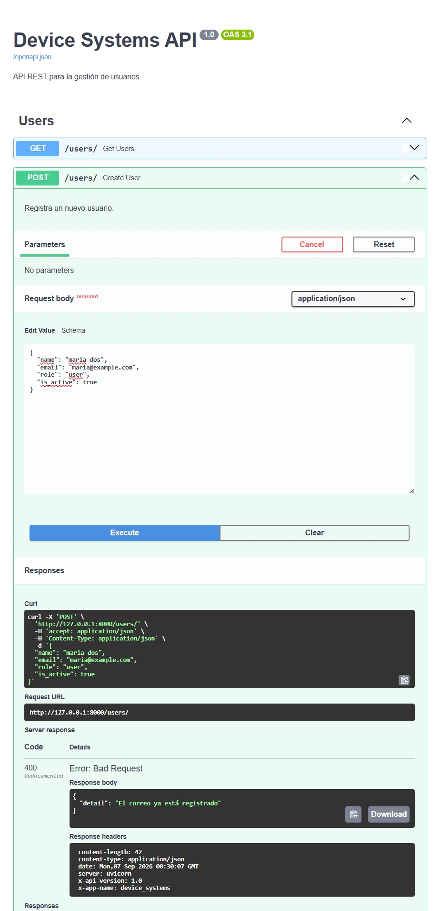
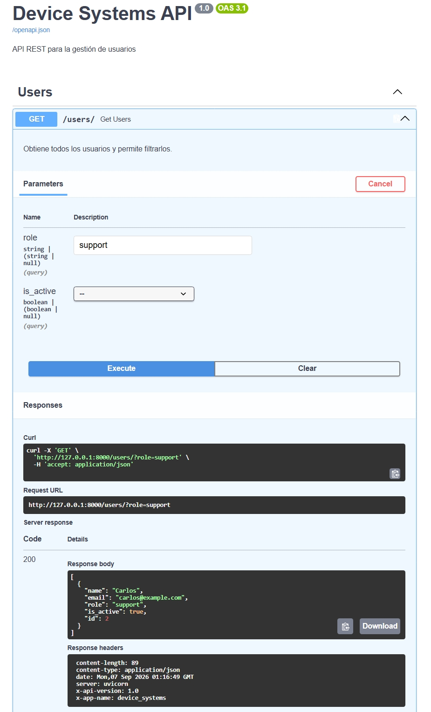

# API REST de Gestión de Usuarios - device_systems

Repositorio correspondiente al desarrollo de la evidencia de aprendizaje **GA1-220501096-01-AA1-EV07 – Fundamentos de FastAPI: API REST para Gestión de Usuarios**, desarrollada como parte del programa **Tecnólogo en Análisis y Desarrollo de Software (ADSO)** del **Servicio Nacional de Aprendizaje (SENA)**.

---

## Descripción del proyecto

Este proyecto corresponde al reto integrador **API REST de Usuarios para device_systems**, desarrollado utilizando **Python y FastAPI** para construir una API REST enfocada en la gestión del recurso usuarios.

La aplicación permite:

* Consultar todos los usuarios registrados.
* Consultar un usuario mediante su ID.
* Filtrar usuarios por rol.
* Filtrar usuarios por estado activo o inactivo.
* Registrar nuevos usuarios.
* Validar los datos mediante Pydantic.
* Evitar el registro de correos electrónicos duplicados.
* Utilizar Path Parameters.
* Utilizar Query Parameters.
* Utilizar Response Models.
* Retornar cabeceras HTTP personalizadas.
* Manejar respuestas y errores HTTP.

La API utiliza una estructura modular para separar la configuración principal, los esquemas de validación y las rutas relacionadas con los usuarios.

---

## Objetivos

### Objetivo general

Desarrollar una API REST funcional utilizando FastAPI para gestionar usuarios del sistema `device_systems`, aplicando validaciones, modelos de entrada y salida, parámetros de ruta, parámetros de consulta y cabeceras HTTP personalizadas.

### Objetivos específicos

* Configurar un proyecto utilizando FastAPI.
* Crear una API REST para la gestión del recurso usuarios.
* Implementar métodos HTTP GET y POST.
* Utilizar Path Parameters para consultar usuarios por ID.
* Utilizar Query Parameters para filtrar usuarios.
* Implementar validaciones de datos mediante Pydantic v2.
* Validar nombres, correos electrónicos, roles y estados de usuario.
* Evitar registros con correos electrónicos duplicados.
* Utilizar Response Models para estandarizar las respuestas.
* Implementar cabeceras HTTP personalizadas.
* Probar los endpoints mediante Swagger UI.
* Documentar el funcionamiento de la API.

---

## Tecnologías utilizadas

| Tecnología  | Uso                                  |
| ----------- | ------------------------------------ |
| Python 3.13 | Lenguaje de programación             |
| FastAPI     | Framework para construir la API REST |
| Pydantic v2 | Validación y modelado de datos       |
| Uvicorn     | Servidor ASGI para ejecutar FastAPI  |
| Swagger UI  | Documentación y pruebas de la API    |
| VS Code     | Editor de código                     |
| Git         | Control de versiones                 |
| GitHub      | Repositorio remoto                   |

---

# Estructura del proyecto

```text
device_systems/
│
├── .venv/
│
├── app/
│   ├── __init__.py
│   │
│   ├── schemas/
│   │   ├── __init__.py
│   │   └── user_schema.py
│   │
│   └── routes/
│       ├── __init__.py
│       └── user_routes.py
│
├── evidencias/
│   ├── 01_get_users.png
│   ├── 02_get_user_id.png
│   ├── 03_query_role.png
│   ├── 04_query_is_active.png
│   ├── 05_post_user.png
│   ├── 06_email_invalido.png
│   ├── 07_nombre_corto.png
│   ├── 08_role_invalido.png
│   ├── 09_correo_duplicado.png
│   └── 10_cabeceras.png
│
├── .gitignore
├── main.py
├── requirements.txt
└── README.md
```

> La carpeta `.venv` corresponde al entorno virtual y no debe ser subida al repositorio de GitHub.

---

# Organización y modularización

El proyecto está dividido en diferentes módulos y paquetes para separar las responsabilidades de la aplicación.

## `app/`

Es el paquete principal de la aplicación.

Contiene las rutas y los esquemas utilizados por la API.

## `app/schemas/`

Este paquete contiene los modelos de datos utilizados para validar las solicitudes y estandarizar las respuestas.

### `user_schema.py`

Contiene los modelos Pydantic relacionados con los usuarios.

Se definieron los siguientes modelos:

```python
UserBase
UserCreate
UserResponse
```

### `UserBase`

Es el modelo base que contiene los datos principales del usuario:

* Nombre.
* Correo electrónico.
* Rol.
* Estado activo.

El nombre debe tener como mínimo 3 caracteres.

El correo electrónico debe tener un formato válido.

El rol solamente puede ser:

```text
admin
support
user
```

El estado del usuario utiliza un valor booleano.

### `UserCreate`

Es el modelo utilizado para validar los datos recibidos cuando se registra un nuevo usuario mediante el endpoint:

```text
POST /users/
```

### `UserResponse`

Es el modelo utilizado para estructurar las respuestas de la API.

Además de los datos básicos del usuario, incluye:

```text
id
```

Esto permite utilizar un `response_model` para estandarizar las respuestas de los endpoints.

---

## `app/routes/`

Este paquete contiene las rutas relacionadas con el recurso usuarios.

### `user_routes.py`

Contiene los endpoints de la API para consultar y registrar usuarios.

También contiene una base de datos temporal almacenada en memoria mediante una lista de diccionarios.

Las operaciones implementadas son:

* Obtener todos los usuarios.
* Obtener un usuario por ID.
* Filtrar usuarios por rol.
* Filtrar usuarios por estado.
* Registrar un nuevo usuario.
* Validar correos electrónicos duplicados.

---

## `main.py`

Es el punto de entrada principal de la aplicación FastAPI.

Se encarga de:

* Crear la aplicación FastAPI.
* Configurar el título de la API.
* Configurar la descripción.
* Definir la versión.
* Registrar las rutas de usuarios.
* Crear el endpoint principal `/`.
* Agregar las cabeceras HTTP personalizadas.

La aplicación se configura de la siguiente manera:

```python
app = FastAPI(
    title="Device Systems API",
    description="API REST para la gestión de usuarios",
    version="1.0"
)
```

---

# Modelo de usuario con Pydantic

Para validar los datos de los usuarios se utilizó **Pydantic v2**.

El modelo base contiene:

```python
class UserBase(BaseModel):
    name: str
    email: EmailStr
    role: Literal["admin", "support", "user"]
    is_active: bool = True
```

## Validación del nombre

El nombre es obligatorio y debe tener mínimo 3 caracteres.

Se implementó mediante:

```python
name: str = Field(
    ...,
    min_length=3,
    description="Nombre del usuario"
)
```

Por ejemplo, el siguiente nombre no es válido:

```text
Jo
```

La API responde:

```text
422 Unprocessable Content
```

---

## Validación del correo electrónico

Se utilizó:

```python
email: EmailStr
```

Esto permite validar automáticamente que el correo tenga un formato válido.

Por ejemplo:

```text
carlos-invalido
```

es rechazado por la API.

La respuesta obtenida es:

```text
422 Unprocessable Content
```

---

## Validación del rol

El campo `role` utiliza `Literal` para restringir los valores permitidos:

```python
role: Literal["admin", "support", "user"]
```

Los únicos valores permitidos son:

```text
admin
support
user
```

Por ejemplo:

```text
manager
```

es rechazado por la API con:

```text
422 Unprocessable Content
```

---

## Validación del estado

El campo:

```python
is_active: bool = True
```

permite indicar si un usuario está activo o inactivo.

Los valores utilizados son:

```text
true
false
```

El valor predeterminado es:

```text
true
```

---

# Endpoints GET

La API implementa diferentes endpoints GET para consultar y filtrar usuarios.

## GET `/users/`

Permite obtener todos los usuarios registrados.

Ejemplo:

```text
GET /users/
```

Respuesta:

```json
[
    {
        "id": 1,
        "name": "Kelly",
        "email": "kelly@example.com",
        "role": "admin",
        "is_active": true
    },
    {
        "id": 2,
        "name": "Carlos",
        "email": "carlos@example.com",
        "role": "support",
        "is_active": true
    },
    {
        "id": 3,
        "name": "Ana",
        "email": "ana@example.com",
        "role": "user",
        "is_active": false
    }
]
```

---

## GET `/users/{user_id}`

Permite consultar un usuario mediante su ID.

El valor enviado en la URL corresponde a un **Path Parameter**.

Ejemplo:

```text
GET /users/1
```

El valor:

```text
1
```

corresponde al parámetro:

```python
user_id: int
```

Si el usuario existe, se retorna su información.

Si el usuario no existe, la API responde:

```text
404 Not Found
```

con el mensaje:

```json
{
    "detail": "Usuario no encontrado"
}
```

---

# Path Parameters

Los Path Parameters permiten recibir valores directamente desde la URL.

En este proyecto se utiliza:

```python
@router.get("/{user_id}", response_model=UserResponse)
def get_user(user_id: int):
```

Por ejemplo:

```text
/users/1
```

donde:

```text
user_id = 1
```

FastAPI utiliza la anotación:

```python
user_id: int
```

para indicar que el identificador debe ser un número entero.

---

# Query Parameters

Los Query Parameters permiten filtrar los usuarios utilizando parámetros en la URL.

Se implementaron dos filtros:

```python
role: str | None = Query(default=None)
is_active: bool | None = Query(default=None)
```

---

## Filtrar por rol

Se puede utilizar:

```text
GET /users/?role=admin
```

Esto permite obtener únicamente los usuarios cuyo rol sea:

```text
admin
```

También se pueden utilizar:

```text
GET /users/?role=support
```

o:

```text
GET /users/?role=user
```

---

## Filtrar por estado

También es posible filtrar usuarios según su estado.

Para obtener usuarios activos:

```text
GET /users/?is_active=true
```

Para obtener usuarios inactivos:

```text
GET /users/?is_active=false
```

Esto permite consultar únicamente los usuarios que coincidan con el estado solicitado.

---

# Endpoint POST

## POST `/users/`

Permite registrar un nuevo usuario.

El endpoint se implementó utilizando:

```python
@router.post(
    "/",
    response_model=UserResponse,
    status_code=201
)
```

Ejemplo de solicitud:

```json
{
    "name": "maria",
    "email": "maria@example.com",
    "role": "user",
    "is_active": true
}
```

La API retorna:

```json
{
    "name": "maria",
    "email": "maria@example.com",
    "role": "user",
    "is_active": true,
    "id": 4
}
```

El código de respuesta obtenido es:

```text
201 Created
```

Esto indica que el usuario fue creado correctamente.

---

# Validación de correos duplicados

Antes de registrar un nuevo usuario, la API verifica si el correo electrónico ya se encuentra registrado.

La validación se realiza mediante:

```python
for existing_user in users_db:
    if existing_user["email"] == user.email:
        raise HTTPException(
            status_code=400,
            detail="El correo ya está registrado"
        )
```

Si se intenta registrar nuevamente:

```text
maria@example.com
```

la API responde:

```text
400 Bad Request
```

Esto evita registrar dos usuarios con el mismo correo electrónico.

---

# Response Models

Para estandarizar las respuestas se utilizó el modelo:

```python
UserResponse
```

El modelo hereda de:

```python
UserBase
```

y agrega el identificador:

```python
id: int
```

Los endpoints utilizan:

```python
response_model=UserResponse
```

Esto permite definir claramente qué información debe devolver la API.

Por ejemplo, el endpoint POST devuelve:

```json
{
    "name": "maria",
    "email": "maria@example.com",
    "role": "user",
    "is_active": true,
    "id": 4
}
```

---

# Cabeceras HTTP personalizadas

La aplicación implementa un middleware para agregar cabeceras HTTP personalizadas a las respuestas.

Se configuraron:

```text
X-App-Name: device_systems
X-API-Version: 1.0
```

El middleware utilizado es:

```python
@app.middleware("http")
async def add_custom_headers(request, call_next):
    response = await call_next(request)

    response.headers["X-App-Name"] = "device_systems"
    response.headers["X-API-Version"] = "1.0"

    return response
```

Estas cabeceras permiten identificar la aplicación y la versión de la API.

---

# Tabla de endpoints

| Método | Endpoint                 | Descripción                |
| ------ | ------------------------ | -------------------------- |
| GET    | `/users/`                | Lista todos los usuarios   |
| GET    | `/users/{user_id}`       | Consulta un usuario por ID |
| GET    | `/users/?role=admin`     | Filtra usuarios por rol    |
| GET    | `/users/?is_active=true` | Filtra usuarios por estado |
| POST   | `/users/`                | Registra un nuevo usuario  |

---

# Instalación y configuración

## 1. Clonar el repositorio

Desde una terminal se puede clonar el proyecto mediante:

```cmd
git clone URL_DEL_REPOSITORIO
```

Después ingresar a la carpeta:

```cmd
cd device_systems
```

---

## 2. Crear el entorno virtual

Se recomienda utilizar un entorno virtual para mantener aisladas las dependencias del proyecto.

Se puede crear mediante:

```cmd
python -m venv .venv
```

---

## 3. Activar el entorno virtual

En Windows:

```cmd
.venv\Scripts\activate
```

Cuando el entorno está activo, la terminal muestra:

```text
(.venv)
```

---

## 4. Instalar las dependencias

Las dependencias se encuentran en:

```text
requirements.txt
```

Para instalarlas:

```cmd
pip install -r requirements.txt
```

Las principales dependencias utilizadas son:

```text
fastapi
uvicorn
pydantic
email-validator
```

---

# Ejecución del proyecto

Con el entorno virtual activado, ejecutar:

```cmd
uvicorn main:app --reload
```

El servidor se inicia normalmente en:

```text
http://127.0.0.1:8000
```

La opción:

```text
--reload
```

permite que el servidor se reinicie automáticamente cuando se realizan cambios en el código.

---

# Swagger UI

FastAPI genera automáticamente una documentación interactiva mediante Swagger UI.

Para acceder a ella:

```text
http://127.0.0.1:8000/docs
```

Desde Swagger UI es posible:

* Consultar los endpoints.
* Ejecutar peticiones GET.
* Ejecutar peticiones POST.
* Enviar parámetros.
* Enviar cuerpos JSON.
* Visualizar respuestas.
* Revisar códigos HTTP.
* Revisar las cabeceras de las respuestas.

---

# Pruebas realizadas

Las pruebas de la API se realizaron utilizando **Swagger UI**.

## Consulta de usuarios

Se realizó una prueba mediante:

```text
GET /users/
```

La API retornó correctamente la lista de usuarios registrados.



---

## Consulta por ID

Se realizó una prueba mediante:

```text
GET /users/1
```

La API retornó correctamente la información del usuario correspondiente al ID solicitado.



---

## Query Parameter por rol

Se realizó una prueba utilizando:

```text
GET /users/?role=admin
```

La API filtró correctamente los usuarios cuyo rol corresponde a `admin`.



---

## Query Parameter por estado

Se realizó una prueba utilizando:

```text
GET /users/?is_active=true
```

La API filtró correctamente los usuarios activos.



---

## Registro de usuario

Se realizó una prueba mediante:

```text
POST /users/
```

utilizando los datos:

```json
{
    "name": "Danna",
    "email": "danna@example.com",
    "role": "admin",
    "is_active": true
}
```

La API respondió con:

```text
201 Created
```

y generó el ID:

```text
4
```



---

# Evidencias de validación y errores

## Email inválido

Se realizó una prueba utilizando un correo electrónico con formato incorrecto.

La API respondió:

```text
422 Unprocessable Content
```

Esto demuestra que `EmailStr` valida correctamente el formato del correo.



---

## Nombre menor de 3 caracteres

Se realizó una prueba utilizando:

```text
Jo
```

La API respondió:

```text
422 Unprocessable Content
```

Esto demuestra la validación:

```python
min_length=3
```



---

## Rol no permitido

Se realizó una prueba utilizando:

```text
manager
```

La API respondió:

```text
422 Unprocessable Content
```

Esto demuestra que Pydantic restringe el campo `role` a los valores permitidos.



---

## Correo duplicado

Se intentó registrar nuevamente un usuario utilizando:

```text
maria@example.com
```

La API respondió:

```text
400 Bad Request
```

Esto demuestra que el sistema evita registros con correos electrónicos duplicados.



---

## Cabeceras HTTP

Las respuestas de la API incluyen las cabeceras personalizadas:

```text
X-App-Name: device_systems
X-API-Version: 1.0
```



---

# Códigos de respuesta utilizados

Durante las pruebas se utilizaron diferentes códigos HTTP.

| Código | Significado           | Situación                        |
| ------ | --------------------- | -------------------------------- |
| 200    | OK                    | Consulta realizada correctamente |
| 201    | Created               | Usuario registrado correctamente |
| 400    | Bad Request           | Correo electrónico duplicado     |
| 404    | Not Found             | Usuario no encontrado            |
| 422    | Unprocessable Content | Datos de entrada no válidos      |

Estos códigos permiten comunicar de manera estructurada el resultado de cada operación realizada sobre la API.

---

# Flujo de funcionamiento de la API

La aplicación utiliza una estructura modular para separar las responsabilidades.

```text
                         main.py
                            │
                            ▼
                    FastAPI Application
                            │
                            ▼
                    user_routes.py
                            │
                ┌───────────┴───────────┐
                │                       │
                ▼                       ▼
             GET /users/            POST /users/
                │                       │
                ▼                       ▼
          Consultar datos        Validar datos
                                        │
                                        ▼
                                user_schema.py
                                        │
                                        ▼
                                    Pydantic
                                        │
                                        ▼
                                Crear usuario
```

### Flujo de una petición GET

```text
Cliente
   ↓
GET /users/
   ↓
FastAPI
   ↓
user_routes.py
   ↓
users_db
   ↓
UserResponse
   ↓
Respuesta JSON
```

### Flujo de una petición POST

```text
Cliente
   ↓
POST /users/
   ↓
FastAPI
   ↓
UserCreate
   ↓
Pydantic
   ↓
Validación
   ↓
Verificación de correo duplicado
   ↓
Crear usuario
   ↓
UserResponse
   ↓
Respuesta 201
```

---

# Base de datos temporal

Para el desarrollo de esta actividad se utilizó una estructura temporal en memoria:

```python
users_db = [
    {
        "id": 1,
        "name": "Kelly",
        "email": "kelly@example.com",
        "role": "admin",
        "is_active": True
    }
]
```

Esta estructura permite realizar las pruebas de los endpoints sin utilizar todavía un sistema gestor de bases de datos.

Los datos permanecen disponibles mientras el servidor está en ejecución.

---

# Documentación automática

Una de las principales ventajas de FastAPI es la generación automática de documentación interactiva.

La documentación puede consultarse mediante:

```text
http://127.0.0.1:8000/docs
```

Swagger UI permite ejecutar directamente las peticiones contra la API, observar los parámetros requeridos, enviar cuerpos JSON y revisar las respuestas.

Esto facilita tanto el desarrollo como las pruebas del proyecto.

---

# Seguridad y buenas prácticas

Durante el desarrollo se aplicaron algunas buenas prácticas:

* Uso de un entorno virtual.
* Separación del código mediante módulos y paquetes.
* Validación de datos mediante Pydantic.
* Uso de modelos de entrada y salida.
* Uso de códigos HTTP apropiados.
* Manejo de errores mediante `HTTPException`.
* Uso de `response_model`.
* Uso de `.gitignore`.
* Separación de las rutas y los esquemas.

El archivo `.gitignore` debe evitar subir archivos innecesarios como:

```text
.venv/
__pycache__/
*.pyc
```

---

# Conceptos aplicados

Durante el desarrollo del proyecto se aplicaron los siguientes conceptos:

* FastAPI.
* APIs REST.
* Python.
* Uvicorn.
* Pydantic v2.
* Modelos de datos.
* `BaseModel`.
* `EmailStr`.
* `Field`.
* `Literal`.
* Response Models.
* Métodos HTTP GET.
* Métodos HTTP POST.
* Path Parameters.
* Query Parameters.
* Cabeceras HTTP.
* Middleware.
* Códigos de respuesta HTTP.
* `HTTPException`.
* Validación de datos.
* Manejo de errores.
* Swagger UI.
* Organización modular.
* Entornos virtuales.
* Git.
* GitHub.

---

# Ventajas de FastAPI

Durante el desarrollo se identificaron varias ventajas de utilizar FastAPI para construir APIs REST:

* Permite desarrollar APIs de manera rápida y organizada.
* Integra validación de datos mediante Pydantic.
* Genera documentación automática mediante Swagger UI.
* Permite trabajar fácilmente con parámetros de ruta y consulta.
* Facilita la definición de modelos de entrada y salida.
* Permite utilizar códigos de respuesta HTTP.
* Cuenta con soporte para middleware.
* Proporciona una estructura adecuada para construir servicios web.
* Facilita las pruebas de los endpoints mediante su documentación interactiva.

---

# Reflexión sobre el uso de FastAPI

El desarrollo de esta actividad permitió comprender cómo se puede construir una API REST utilizando FastAPI y Python.

Durante el proyecto se aprendió a crear endpoints utilizando los métodos GET y POST, así como a utilizar Path Parameters y Query Parameters para enviar información mediante las solicitudes HTTP.

El uso de Pydantic permitió validar los datos de los usuarios de manera automática, verificando aspectos como el formato del correo electrónico, la longitud mínima del nombre y los valores permitidos para el rol.

También fue posible comprender la importancia de los Response Models para controlar y estandarizar la información que retorna una API.

La implementación de cabeceras HTTP personalizadas permitió conocer una forma adicional de proporcionar información sobre la aplicación y su versión.

Finalmente, el uso de Swagger UI facilitó las pruebas de los endpoints y permitió observar directamente las solicitudes, respuestas y códigos HTTP generados por la API.

Esta actividad permitió fortalecer los conocimientos sobre el desarrollo de servicios backend y comprender mejor el funcionamiento de las APIs REST utilizando herramientas modernas de Python.

---

# Conclusión

El desarrollo del proyecto **device_systems** permitió implementar una API REST funcional para la gestión de usuarios utilizando FastAPI.

La aplicación cumple con los requisitos principales establecidos en la actividad, incluyendo los endpoints GET y POST, Path Parameters, Query Parameters, validaciones mediante Pydantic, Response Models y cabeceras HTTP personalizadas.

Las validaciones implementadas permiten controlar los datos ingresados por los usuarios y evitar información incorrecta, como correos electrónicos con formato inválido, nombres demasiado cortos, roles no permitidos y correos duplicados.

La utilización de Swagger UI facilitó las pruebas y documentación de la API, permitiendo verificar el comportamiento de los diferentes endpoints y observar los códigos de respuesta HTTP.

Finalmente, el proyecto permitió aplicar de manera práctica los fundamentos de FastAPI y comprender cómo organizar una aplicación backend modular orientada al desarrollo de APIs REST.

---

# Autor

**Kelly Johana Lopera Chica**

Aprendiz del programa **Tecnólogo en Análisis y Desarrollo de Software (ADSO)**

Servicio Nacional de Aprendizaje **SENA**
